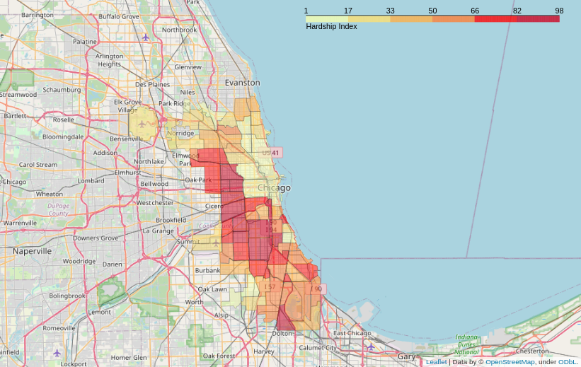
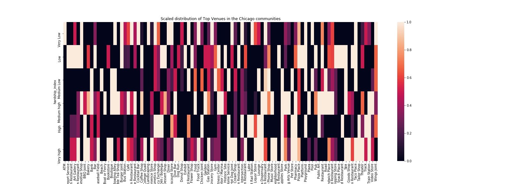
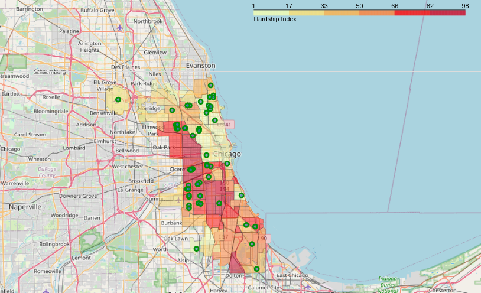

### Coursera Capstone

# Chicago Hardship Index and Venues
---
Chicago is a multicultural city and provides many opportunities to its inhabitants. However not all communities present in the city have the same distribution and opportunities are different for people living among different areas.
The Chicago goverment have deployed a **hardship index** which is a multidimensional measure of community socioeconomic conditions, the higher the index the worse economical and social conditions are.

Using the information provided by Foursquare we want to asses which kind of venues are present in communities with different hardship indexes. If there are any differences, we can use this information to propose building specific types of venues to improve the communities conditions.

Also we aim to verify if the venue consistency in a neighborhood will be a good predictor for the hardship index, this will be useful to quickly assess the conditions of different locations without censing the population directly.

# The Data
---
We are going to use the **Chicago Hardship Index** based on Census Data from 2008 to 2012, from this dataset we are going to use only two columns the Community Area Name and the Hardship Index.

Along this dataset we are going to use Foursquare database to check what venues are more popular in each of the Community Areas, we are going to use the Category column from this dataset. 

Lastly to plot our findings in the map we are going to use the shape files corresponding to the boundaries of the Community Areas provided by the Chicago City government. Available at: https://data.cityofchicago.org/Facilities-Geographic-Boundaries/Boundaries-Community-Areas-current-/cauq-8yn6

The Chicago Hardship Index dataset is publicly available at https://data.cityofchicago.org/Health-Human-Services/hardship-index/792q-4jtu and it consists in 78 rows by 7 columns, each row corresponding to one community plus one extra row for the Chicago city average. The columns are:

- Hardship Index
- Community Area Name
- Percent of Households Below Poverty
- Percent of people aged 25+ without a Highschool Diploma
- Percent of people aged 16+ unemployed
- Percent of people aged below 18 or over 64
- Per Capita Income

For the scope of this exercise we're are only going to use the 'Hardship Index' column and the 'Community Area Name'

The Foursquare data was obtained via API, in this case the data requested was the venues in a radius of 500m around a given community, the information returned is the venue name, the venue location (latitude, longitude) and the venue category.

# How to?
---
First the Hardship Index was transformed from a continuous variable to a categorical variable consisting in six categories: very low, low, medium low, medium high, high and very high.

After that only the top 3 venue categories of each community were selected and then grouped by the category of Hardship Index that the community belongs to.

A chi-squared test was used for the analysis of the distribution of top 3 venue categories in each community

A k-nearest neighbors model will be used to classifier will be trained to identify the Hardship Index category of a certain community based on its venues, also a Random Forest Classifier will be trained with the same objective.

# The results
---
We can se the different values of Hardship Index in the Chicago Neighborhoods in the next map:

The data showed that the distribution of the venues was not significantly different between the communities, the p-value of almost 1, the distribution can be seen in this heatmap.

Also the f1-scores for the k-nearest neighbors classifier and the random forest were only 0.20, so both models performed poorly.

# Conclusions
---

The Chicago communities are pretty similar in types of venues distribution so they are not a good predictor of the Hardship Index. Unfortunately this mean that (at least with the data presented here) there are no clear indications of which kind of venues can improve a community socioeconomic conditions, in the data obtained through the analysis we can verify that some buildings and spaces that we might think can improve community life such as parks are more represented in communities with high Hardship Index, indicating that the problem may lay elsewhere.

> “It’s fine to celebrate success but it is more important to heed the lessons of failure.” — Bill Gates

### Extra: 
---
Mexican Restaurants are the top venue at low Hardship Index locations, so if you are loooking for some comfort food you can go to your local mexican deliciousness parlor

If you're from Chicago I leave you here a map of mexican restaurants

